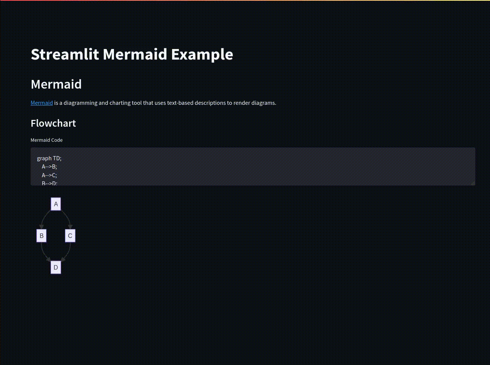

# streamlit-mermaid

Streamlit Component, for Mermaid.

## Installation

```bash
pip install streamlit-mermaid
```

## Quick start

```py
import streamlit_mermaid as stmd
import streamlit as st

code = """
graph TD
    A --> B
"""

stmd.st_mermaid(code)
```

```bash
streamlit run examples/example.py
```


